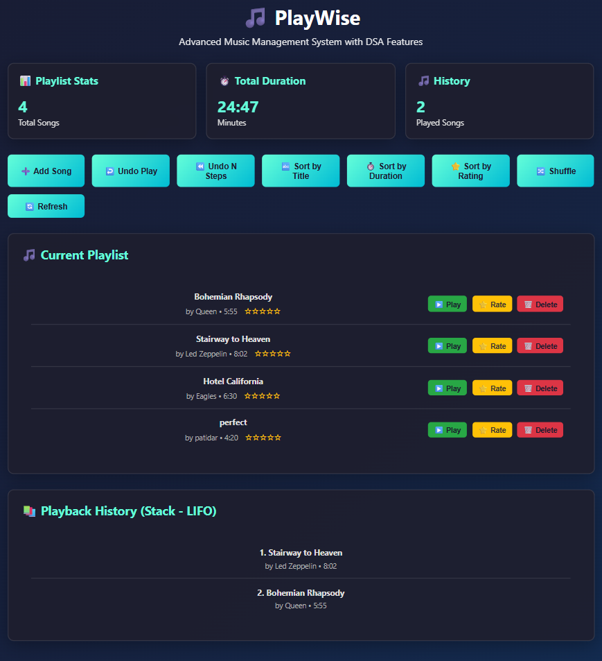
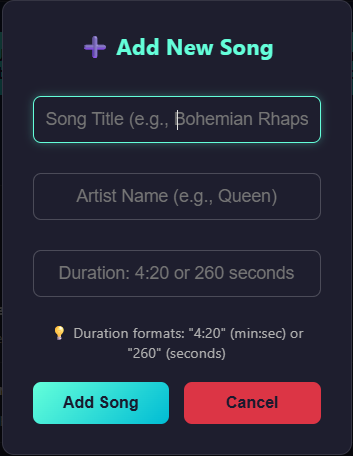

# PlayWise - Advanced Music Management System


PlayWise is a comprehensive music management system built in C++ that demonstrates advanced data structures and algorithms concepts. This project showcases a complete music library management solution with both a powerful C++ backend and an intuitive web interface.

## 🎵 Features

### Core Functionality
- **Smart Playlist Management**: Add, delete, move, and organize songs with ease
- **Advanced Search**: Find songs by ID, title, or partial matches
- **Rating System**: Rate songs from 1-5 stars and filter by ratings
- **Playback History**: Track and undo recently played songs
- **Multiple Sorting Options**: Sort by title, artist, duration, date, or rating

### Advanced Algorithms
- **Merge Sort**: Optimized sorting by title and duration
- **Quick Sort**: Efficient sorting by artist and rating
- **Smart Shuffle**: Intelligent shuffling that avoids consecutive songs by the same artist
- **Command Pattern**: Full undo/redo functionality for all operations

### Data Structures Used
- **Doubly Linked List**: Efficient playlist management
- **Hash Map (unordered_map)**: Fast song lookup by ID
- **Binary Search Tree (map)**: Organized rating system
- **Stack**: Playback history and undo operations

## 🚀 Getting Started

### Prerequisites
- C++17 compatible compiler (g++, Visual Studio, etc.)
- Modern web browser (for web interface)
- Windows/Linux/macOS

### Compilation

#### Compilation
```bash
g++ -std=c++17 -o playwise.exe playwise.cpp
```

### Running the Application

#### Command Line Interface
```bash
g++ -std=c++17 -o playwise.exe playwise.cpp
./playwise.exe
```

#### Web Interface
Open `playwise_minimal_ui.html` in your web browser to access the user-friendly interface.

## 📸 Screenshots

### Web Interface Dashboard

*Clean and intuitive dashboard showing the music library overview*

### Add Song Feature

*Easy-to-use interface for adding new songs to your library*

## 🎮 Usage Examples

### Command Line Interface

```
--- PlayWise CLI Menu ---
add                                      - Add a song
delete <index>                           - Delete a song
move <from_idx> <to_idx>                 - Move a song
print                                    - Print playlist
play <index | ID | "Title">              - Play a song
sort <title|duration|date|rating>        - Sort playlist
merge_title                              - Merge Sort by title
quick_artist                             - Quick Sort by artist
shuffle                                  - Shuffle playlist
undo [N]                                 - Undo last N edit(s)
snapshot                                 - Show system snapshot
```

#### Example Commands
```bash
# Add a new song
add
Enter Title | Artist | Duration: Bohemian Rhapsody | Queen | 6:03

# Play a song
play "Bohemian Rhapsody"

# Sort playlist by duration
sort duration

# Undo last 3 operations
undo 3

# Get system snapshot
snapshot
```

### Web Interface
- **Add Songs**: Intuitive form to add new tracks to your library
- **Dashboard View**: Clean overview of your music collection
- **Search & Filter**: Easy navigation through your music library
- **Responsive Design**: Works on desktop and mobile devices

## 🏗️ Architecture

### Core Components

1. **PlayWiseEngine**: Main engine class managing all operations
2. **Song Structure**: Core data object with metadata
3. **Command Pattern**: Undo/redo functionality
4. **Node Structure**: Doubly linked list implementation

### Data Flow
```
User Input → Command Processing → Data Structure Updates → Output Display
     ↓              ↓                       ↓                    ↓
   CLI/Web     Command Pattern         Linked List          Console/Web
```

### Advanced Features

#### Sorting Algorithms
- **Merge Sort**: O(n log n) stable sorting for title/duration
- **Quick Sort**: O(n log n) average case for artist/rating
- **STL Sort**: Optimized standard library sorting

#### Memory Management
- Smart pointers (shared_ptr, unique_ptr) for automatic memory management
- Weak pointers to prevent circular references
- RAII principles throughout

## 🧪 Testing

### Running the Application
```bash
g++ -std=c++17 -o playwise.exe playwise.cpp
./playwise.exe
```

The application comes with sample data and comprehensive testing of all features through the CLI interface.

## 📁 Project Structure

```
PlayWise/
├── playwise.cpp                 # Main C++ application with CLI
├── playwise_minimal_ui.html     # Web interface
├── README.md                    # Project documentation
└── screenshots/                 # Application screenshots
    ├── dashboard.png
    └── add_song.png
```

## 🔧 Technical Details

### Requirements
- **Language**: C++17
- **Compiler**: g++ (recommended), Visual Studio, Clang
- **Dependencies**: Standard Library only
- **Platform**: Cross-platform (Windows, Linux, macOS)

### Performance
- **Time Complexity**: O(1) for most operations, O(n log n) for sorting
- **Space Complexity**: O(n) where n is the number of songs
- **Memory**: Efficient with smart pointer management

### Design Patterns
- **Command Pattern**: Undo/redo functionality
- **Observer Pattern**: Event-driven updates
- **Strategy Pattern**: Multiple sorting algorithms
- **Factory Pattern**: Song creation

## 🤝 Contributing

1. Fork the repository
2. Create a feature branch (`git checkout -b feature/amazing-feature`)
3. Commit your changes (`git commit -m 'Add amazing feature'`)
4. Push to the branch (`git push origin feature/amazing-feature`)
5. Open a Pull Request

## 📝 License

This project is licensed under the MIT License - see the [LICENSE](LICENSE) file for details.

## 🙏 Acknowledgments

- Built with modern C++17 features
- Inspired by real-world music management needs
- Implements classic computer science algorithms and data structures

## 📞 Contact

- **Project Link**: [https://github.com/Kushal-V/Playwise-DSA-concept-.git](https://github.com/Kushal-V/Playwise-DSA-concept-.git)

---

⭐ **Star this repository if you found it helpful!** ⭐

THANK YOU!
